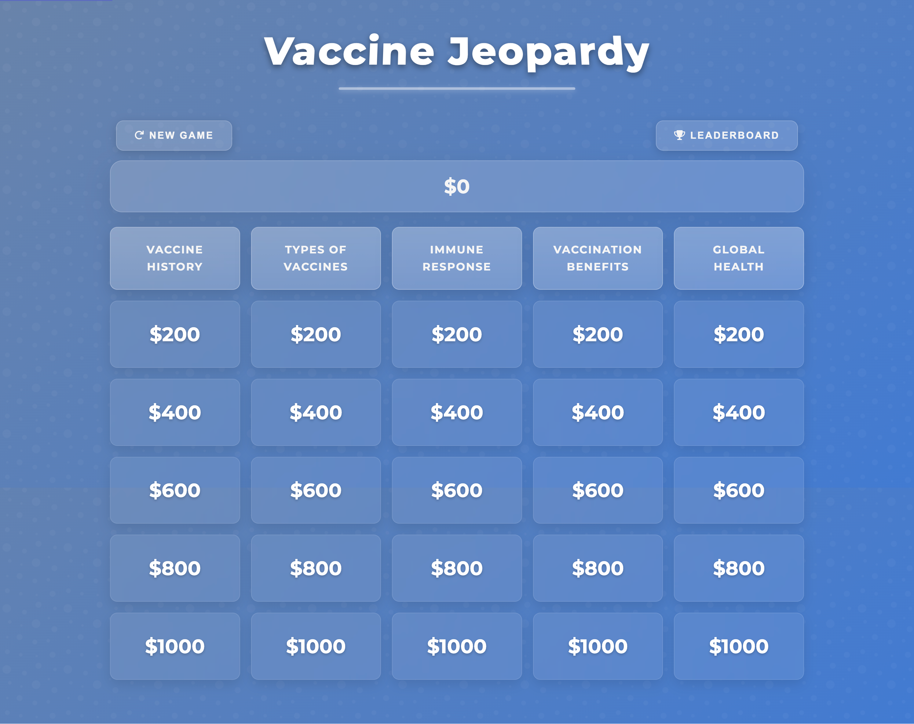

# Vaccine Jeopardy

An interactive Jeopardy-style quiz game focused on vaccine knowledge, featuring an accessible and beautiful Glassmorphism UI design.



## Features

- Single-player quiz game with Jeopardy-style format
- Five categories with questions ranging from $200-$1000
- Randomized questions for a new experience each game
- 30-second timer for each question
- Leaderboard to track top scores
- Social sharing options
- Responsive design for all screen sizes
- Full keyboard accessibility
- Screen reader compatibility

## Educational Content

Learn about vaccines through these categories:
- **Vaccine History**: Development and major milestones
- **Types of Vaccines**: Different vaccine technologies and mechanisms
- **Immune Response**: How vaccines interact with your immune system
- **Vaccination Benefits**: Positive impacts on public health
- **Global Health**: Vaccines in worldwide public health context

## Accessibility Features

This game is designed to be accessible to all users:
- Keyboard navigation
- ARIA attributes for screen readers
- Focus management
- Color contrast meeting WCAG standards
- Skip links
- Live region announcements for dynamic content

## Technologies Used

- HTML5
- CSS3 (with Glassmorphism design)
- JavaScript (vanilla)
- Font Awesome icons
- Local Storage for saving scores

## How to Run

1. Clone the repository:
```bash
git clone https://github.com/Jerlyn/vaccine-jeopardy.git
```

2. Open `index.html` in your preferred browser.

3. No build process or special server required!

## File Structure

```
vaccine-jeopardy/
├── index.html      (HTML structure)
├── css/
│   └── style.css   (CSS styling)
├── js/
│   └── game.js     (JavaScript logic)
└── README.md       (Documentation)
```

## Setup Instructions

1. Create the file structure above with the following directories:
   - Root directory: `vaccine-jeopardy`
   - CSS directory: `vaccine-jeopardy/css`
   - JavaScript directory: `vaccine-jeopardy/js`

2. Place each file in its appropriate directory:
   - `index.html` in the root directory
   - `style.css` in the css directory (remove the `<style>` tags)
   - `game.js` in the js directory (remove the `<script>` tags)

3. Ensure all file paths in index.html are correct:
   - CSS path: `href="css/style.css"`
   - JavaScript path: `src="js/game.js"`

## Complete Index.html File

For your convenience, here's the complete HTML structure that should be in your index.html file:

```html
<!DOCTYPE html>
<html lang="en">
<head>
    <meta charset="UTF-8">
    <meta name="viewport" content="width=device-width, initial-scale=1.0">
    <title>Vaccine Jeopardy</title>
    <link rel="stylesheet" href="https://cdnjs.cloudflare.com/ajax/libs/font-awesome/6.0.0/css/all.min.css">
    <link rel="stylesheet" href="css/style.css">
</head>
<body>
    <a href="#main" class="skip-link">Skip to main content</a>
    
    <div aria-live="polite" class="announce-for-sr" id="sr-announce"></div>
    
    <div class="container">
        <header>
            <h1>Vaccine Jeopardy</h1>
        </header>

        <main id="main">
            <!-- Welcome Screen -->
            <div id="welcome-screen" class="screen active glass" style="padding: 2rem; text-align: center;">
                <h2>Welcome to Vaccine Jeopardy!</h2>
                <p>Test your knowledge about vaccines and earn points!</p>
                
                <!-- Brief Instructions -->
                <div style="text-align: left; margin: 1.5rem 0; max-width: 600px; margin-left: auto; margin-right: auto;">
                    <h3>Quick Guide:</h3>
                    <ul style="margin-bottom: 1.5rem;">
                        <li>Select questions from categories worth $200-$1000</li>
                        <li>Answer within 30 seconds to earn points</li>
                        <li>Correct answers add points, incorrect answers subtract points</li>
                        <li>Try to earn as many points as possible!</li>
                    </ul>
                    
                    <p>Categories include: Vaccine History, Types of Vaccines, Immune Response, Vaccination Benefits, and Global Health.</p>
                </div>
                
                <div class="screen-buttons">
                    <button id="start-game-btn" class="btn">Start Game</button>
                    <button id="show-leaderboard-btn" class="btn">Leaderboard</button>
                    <button id="start-instructions-btn" class="btn">Detailed Instructions</button>
                </div>
            </div>

            <!-- Instructions Screen -->
            <div id="instructions-screen" class="screen glass instructions-container">
                <h2>How to Play Vaccine Jeopardy</h2>
                
                <p><strong>Objective:</strong> Answer questions correctly to earn points and become the Vaccine Jeopardy champion!</p>
                
                <h3>Gameplay:</h3>
                <ul>
                    <li>Choose a category and point value from the game board</li>
                    <li>Read the question and select your answer within 30 seconds</li>
                    <li>Correct answers earn the point value shown</li>
                    <li>Incorrect answers deduct the point value</li>
                    <li>Try to answer as many questions as you can to maximize your score</li>
                </ul>
                
                <h3>Categories:</h3>
                <p>The game features five categories related to vaccines:</p>
                <ul>
                    <li><strong>Vaccine History</strong> - The development and history of vaccines</li>
                    <li><strong>Types of Vaccines</strong> - Different vaccine technologies and mechanisms</li>
                    <li><strong>Immune Response</strong> - How vaccines interact with your immune system</li>
                    <li><strong>Vaccination Benefits</strong> - The positive impacts of vaccination</li>
                    <li><strong>Global Health</strong> - Vaccines in the context of worldwide public health</li>
                </ul>
                
                <h3>Scoring:</h3>
                <ul>
                    <li>Questions range from $200 (easier) to $1000 (harder)</li>
                    <li>Your final score will be recorded on the leaderboard if it ranks in the top 10</li>
                </ul>
                
                <div class="screen-buttons">
                    <button id="start-game-from-instructions-btn" class="btn">Start Game</button>
                    <button id="back-to-welcome-from-instructions-btn" class="btn">Back</button>
                </div>
            </div>

            <!-- Game Screen -->
            <div id="game-screen" class="screen">
                <div class="header-controls" style="display: flex; justify-content: space-between; margin-bottom: 1rem;">
                    <button id="new-game-btn" class="btn" aria-label="Start a new game">
                        <i class="fas fa-redo" aria-hidden="true"></i> New Game
                    </button>
                    <button id="show-leaderboard-during-game-btn" class="btn">
                        <i class="fas fa-trophy" aria-hidden="true"></i> Leaderboard
                    </button>
                </div>

                <div class="score-display glass">
                    <div>Current Score: <span id="current-score" class="score-value">$0</span></div>
                </div>

                <div id="game-board" class="game-board" aria-label="Jeopardy game board"></div>
            </div>

            <!-- Game Over Screen -->
            <div id="game-over-screen" class="screen glass" style="padding: 2rem; text-align: center;">
                <div class="game-summary">
                    <h2>Game Over!</h2>
                    <p>Your final score:</p>
                    <div id="final-score" class="final-score">$0</div>
                </div>

                <div id="name-entry" style="margin: 2rem 0;">
                    <p>Enter your name to save your score:</p>
                    <div style="display: flex; gap: 1rem; justify-content: center; margin-top: 1rem;">
                        <input type="text" id="player-name-input" style="padding: 0.75rem; border-radius: 8px; border: none; width: 250px;" placeholder="Your name">
                        <button id="save-score-btn" class="btn">Save Score</button>
                    </div>
                </div>

                <div class="screen-buttons">
                    <button id="play-again-btn" class="btn">Play Again</button>
                    <button id="show-leaderboard-after-game-btn" class="btn">View Leaderboard</button>
                </div>

                <div class="share-section">
                    <h3>Share your game:</h3>
                    <button class="btn share-btn" id="share-twitter" aria-label="Share on Twitter">
                        <i class="fab fa-twitter" aria-hidden="true"></i>
                    </button>
                    <button class="btn share-btn" id="share-facebook" aria-label="Share on Facebook">
                        <i class="fab fa-facebook" aria-hidden="true"></i>
                    </button>
                    <button class="btn share-btn" id="share-copy" aria-label="Copy link">
                        <i class="fas fa-link" aria-hidden="true"></i>
                    </button>
                </div>
            </div>

            <!-- Leaderboard Screen -->
            <div id="leaderboard-screen" class="screen glass leaderboard">
                <h2>Top Scores</h2>
                <ol id="leaderboard-list" class="leaderboard-list"></ol>
                <div class="screen-buttons">
                    <button id="back-from-leaderboard-btn" class="btn">Back</button>
                </div>
            </div>
        </main>
    </div>

    <!-- Question Modal -->
    <div id="question-modal" class="modal" role="dialog" aria-labelledby="question-title" aria-modal="true">
        <div class="modal-content glass">
            <h2 id="question-title" class="sr-only">Question</h2>
            <div id="question-category" aria-live="polite"></div>
            <div id="question-value" aria-live="polite"></div>
            <div id="question-text" class="question-text" aria-live="polite"></div>
            <div id="answers" class="answers"></div>
            <div id="timer" class="timer" aria-live="polite">30</div>
            <div id="result-feedback" aria-live="assertive"></div>
        </div>
    </div>

    <script src="js/game.js"></script>
</body>
</html>
```

## License

[MIT License](LICENSE)

## Credits

- Created by: Jerlyn
- Design: Glassmorphism UI with accessibility features
- Special thanks to: Commonwealth of Dominica